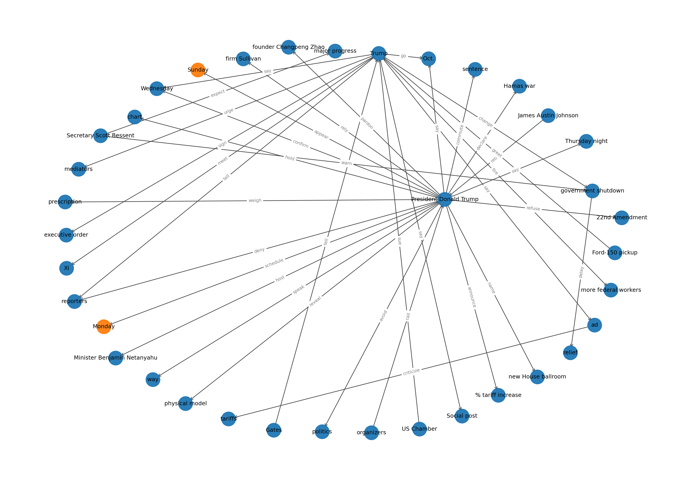

# Event Extraction & Knowledge Graph Builder

Lightweight NLP prototypes for:
- extracting **events** and **entities** from short texts/headlines
- ranking similar humanitarian event snippets with **semantic search**
- generating a simple **knowledge graph** from news/headlines

> This repo is intentionally “small and hackable”: the scripts are readable and meant for experimentation.

---

## Quickstart

```bash
# 1) create a venv (recommended)
python -m venv .venv
source .venv/bin/activate

# 2) install deps
pip install -r requirements.txt

# 3) spaCy model (required for NER)
python -m spacy download en_core_web_sm
```

Run a simple event-extraction demo:

```bash
python -m src.event_extraction.event_extraction --demo
```

---

## What’s inside

### 1) Event extraction (TF‑IDF + keyword matching)
- **File:** `src/event_extraction/event_extraction.py`
- **Outputs:** list of extracted events/entities per input text

### 2) Semantic ranking + “why is this relevant?” explanations
- **File:** `src/event_rank_explain/main.py`
- Uses SentenceTransformers embeddings + cosine similarity
- (Optional) explanation generation via a HuggingFace text-generation pipeline

### 3) Knowledge graph generation
- **Folder:** `src/knowgraph/`
- Builds a directed graph from subject/verb/object patterns and visualizes with NetworkX

---

## Usage

### Event extraction

**Demo mode** (built-in sample headlines):

```bash
python -m src.event_extraction.event_extraction --demo
```

**Pass your own texts**:

```bash
python -m src.event_extraction.event_extraction \
  --text "Massive explosion rocks Beirut port area" \
  --text "Thousands protest government corruption in the capital"
```

---

### Semantic search + explanation

This script is heavier (downloads/loads models) and is best run as a standalone script:

```bash
python -m src.event_rank_explain.main --query "flood displacement" --top-k 5
```

If you want *ranking only* (no generated explanations), add:

```bash
python -m src.event_rank_explain.main --query "flood displacement" --top-k 5 --no-explain
```

---

### Knowledge graph generation

There are multiple variants in `src/knowgraph/`. A common starting point is generating from headlines:

```bash
python -m src.knowgraph.kg_creation_from_headlines --demo
```

Outputs are written under:

- `src/knowgraph/output/`

Example graph:



---

## Configuration

### spaCy model
Most modules require:

```bash
python -m spacy download en_core_web_sm
```

If the model is missing, the scripts will fail with a clear message.

### NewsAPI (optional)
Some KG scripts fetch live articles via NewsAPI.

Set an environment variable:

```bash
export NEWSAPI_KEY="your_key_here"
```

(If you don’t set it, run the `--demo` modes instead.)

---

## Project structure

```text
.
├── src/
│   ├── event_extraction/          # event + entity extraction
│   ├── event_rank_explain/        # semantic ranking + explanations
│   └── knowgraph/                 # KG construction + visualizations
└── test/
    └── test_event_extractor.py
```

---

## Running tests

```bash
pytest
```

---

## Notes & limitations

- These are **prototype scripts** (not a polished library/API yet).
- Some parts (transformers pipelines) can be slow on CPU and may download large models.
- Headline parsing is simplistic; improving SVO extraction and coreference resolution would improve graph quality.

